<!-- README.md is generated from README.Rmd. Please edit that file -->

# UtilsGGSV

<!-- badges: start -->

[](https://github.com/SATVILab/UtilsGGSV/actions/workflows/R-CMD-check.yaml)
[](https://codecov.io/gh/SATVILab/UtilsGGSV)
<!-- badges: end -->

The goal of UtilsGGSV is to provide utility functions for plotting in R
using `ggplot2`.

## Installation

You can install `UtilsGGSV` from [GitHub](https://github.com/) with:

``` r
if (!requireNamespace("remotes", quietly = TRUE)) install.packages("remotes")
remotes::install_github("SATVILab/UtilsGGSV")
```

## Examples

``` r
library(UtilsGGSV)
library(ggplot2)
theme_set(cowplot::theme_cowplot())
```

### Correlation Plots with `ggcorr`

The function `ggcorr` plots correlation coefficients:

``` r
set.seed(3)
response_vec_a <- rnorm(5)
response_tbl <- data.frame(
  group = rep(letters[1:3], each = 5),
  response = c(
    response_vec_a,
    response_vec_a * 1.2 + rnorm(5, sd = 0.2),
    response_vec_a * 2 + rnorm(5, sd = 2)
  ),
  pid = rep(paste0("id_", 1:5), 3)
)

ggcorr(
  data = response_tbl %>% dplyr::filter(group %in% c("a", "b")),
  grp = "group",
  y = "response",
  id = "pid"
)
```


We can display multiple correlation coefficients:

``` r
ggcorr(
  data = response_tbl %>% dplyr::filter(group %in% c("a", "b")),
  grp = "group",
  y = "response",
  id = "pid",
  corr_method = c("spearman", "pearson")
)
```

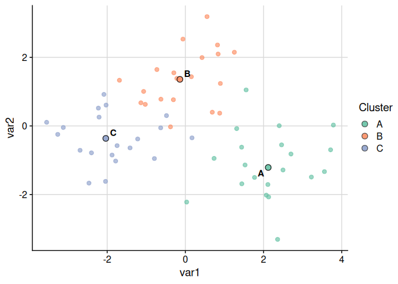

We can compare more than two groups:

``` r
ggcorr(
  data = response_tbl,
  grp = "group",
  y = "response",
  id = "pid",
  corr_method = "kendall"
)
```

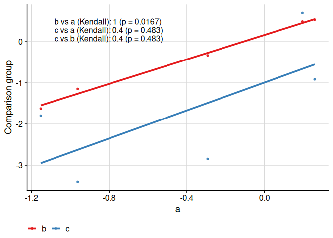

We can compare more than two groups and multiple correlation
coefficients:

``` r
ggcorr(
  data = response_tbl,
  grp = "group",
  y = "response",
  id = "pid",
  corr_method = c("spearman", "pearson")
)
```

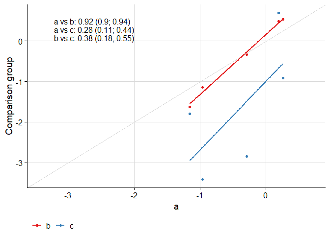

Specific functionality to make appropriate plots for the concordance
correlation coefficient is available:

``` r
ggcorr(
  data = response_tbl %>% dplyr::filter(group %in% c("a", "b")),
  grp = "group",
  y = "response",
  id = "pid",
  corr_method = "concordance",
  abline = TRUE,
  limits_equal = TRUE
)
```


Text in table can be moved around and resized:

``` r
ggcorr(
  data = response_tbl %>% dplyr::filter(group %in% c("a", "b")),
  grp = "group",
  y = "response",
  id = "pid",
  corr_method = c("spearman", "pearson", "concordance"),
  abline = TRUE,
  limits_equal = TRUE,
  coord = c(0.4, 0.17),
  font_size = 3,
  skip = 0.04,
  pval_signif = 2,
  est_signif = 2,
  ci_signif = 2
)
```

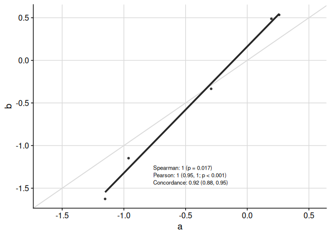

Finally, the text placement is kept consistent when the axes are
visually transformed:

``` r
ggcorr(
  data = response_tbl %>% dplyr::mutate(response = abs(response + 1)^4),
  grp = "group",
  y = "response",
  id = "pid",
  corr_method = "spearman",
  abline = TRUE,
  limits_equal = TRUE,
  trans = "log10",
  skip = 0.06
)
```


### Axis Limits with `axis_limits`

Fix axis limits to be equal between x- and y-axes, and/or expand axis
coordinates. The primary use of `axis_limits` is forcing the x- and
y-axes to have the same limits “automatically” (i.e. by inspecting the
`ggplot` object, thus not requiring the user to manually calculate
limits to pass to `ggplot2::expand_limits`).

``` r
data("cars", package = "datasets")

p0 <- ggplot(cars, aes(speed, dist)) +
  cowplot::background_grid(major = "xy") +
  geom_point() +
  theme(plot.title = element_text(hjust = 0.5)) +
  labs(title = "Axes unadjusted") +
  labs(x = "Speed", y = "Distance")
p1 <- axis_limits(
  p = p0,
  limits_equal = TRUE
) +
  labs(title = "Axes limits equal")
p2 <- axis_limits(
  p = p0,
  limits_expand = list(
    x = c(0, 50),
    y = c(-10, 200)
  )
) +
  labs(title = "Axes limits expanded")
cowplot::plot_grid(p0, p1, p2)
```

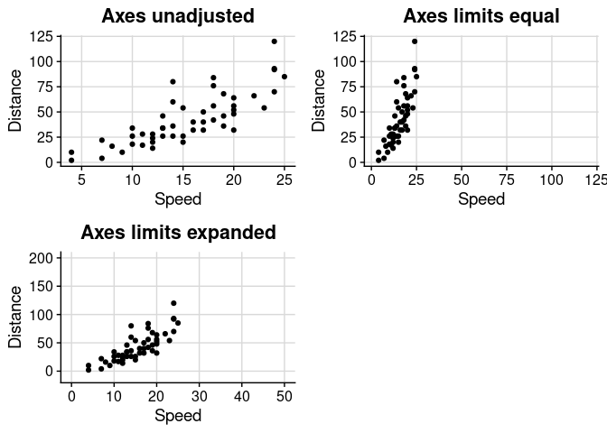

### Text Annotations with `add_text_column`

Add a column of text easily to a plot, regardless of underlying
transformation, using `add_text_column`.

``` r
data_mod <- data.frame(x = rnorm(mean = 1, 10)^2)
data_mod$y <- data_mod$x * 3 + rnorm(10, sd = 0.5)
fit <- lm(y ~ x, data = data_mod)
coef_tbl <- coefficients(summary(fit))
results_vec <- c(
  paste0(
    "Intercept: ",
    signif(coef_tbl[1, "Estimate"][[1]], 2),
    " (",
    signif(coef_tbl[1, 1][[1]] - 2 * coef_tbl[1, 2][[1]], 3),
    ", ",
    signif(coef_tbl[1, 1][[1]] + 2 * coef_tbl[1, 2][[1]], 3),
    "; p = ",
    signif(coef_tbl[1, 4][[1]], 3),
    ")"
  ),
  paste0(
    "Slope: ",
    signif(coef_tbl[2, "Estimate"][[1]], 2),
    " (",
    signif(coef_tbl[2, 1][[1]] - 2 * coef_tbl[2, 2][[1]], 3),
    ", ",
    signif(coef_tbl[2, 1][[1]] + 2 * coef_tbl[2, 2][[1]], 3),
    "; p = ",
    signif(coef_tbl[2, 4][[1]], 3),
    ")"
  )
)
p <- ggplot(
  data = data_mod,
  aes(x = x, y = y)
) +
  geom_point() +
  cowplot::background_grid(major = "xy") 
add_text_column(
  p = p,
  x = data_mod$x,
  y = data_mod$y,
  text = results_vec,
  coord = c(0.05, 0.95),
  skip = 0.07
)
```


Note that `add_text_column` places text in the same position, regardless
of underlying transformation.

``` r
p <- p +
  scale_y_continuous(
    trans = UtilsGGSV::get_trans("asinh")
  )
add_text_column(
  p = p,
  x = data_mod$x,
  y = data_mod$y,
  text = results_vec,
  trans = UtilsGGSV::get_trans("asinh"),
  coord = c(0.05, 0.95),
  skip = 0.07
)
```

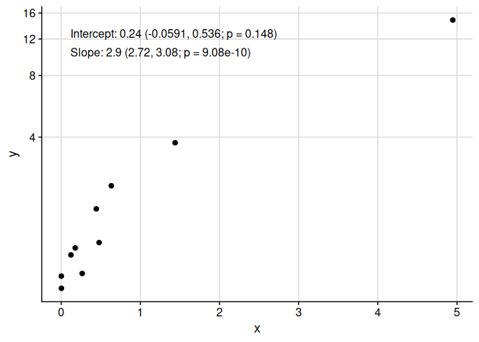

### Cluster-Specific Plots

The `plot_cluster_*` family of functions helps visualise the
characteristics of clusters identified by an unsupervised learning
method.

#### Heat Maps with `plot_cluster_heatmap`

The function `plot_cluster_heatmap` creates a heat map where each tile
shows the percentile of the median value of a variable for a cluster.
This percentile is compared against the ECDF of that variable across all
observations not in the cluster. Clusters and variables are ordered by
hierarchical clustering.

``` r
set.seed(1)
cluster_data <- data.frame(
  cluster = rep(paste0("C", 1:3), each = 20),
  var1 = c(rnorm(20, 2), rnorm(20, 0), rnorm(20, -2)),
  var2 = c(rnorm(20, -1), rnorm(20, 1), rnorm(20, 0))
)
plot_cluster_heatmap(cluster_data, cluster = "cluster")
```


#### Density Plots with `plot_cluster_density`

The function `plot_cluster_density` visualises, for each variable, how
each cluster’s observations are distributed relative to the overall
population. The `density` argument controls what is shown: `"overall"`
(default, overall density plus cluster median lines), `"cluster"` (one
density curve per cluster), or `"both"` (overall density plus
per-cluster density curves). When showing per-cluster densities, the
`scale` argument controls scaling: by default (`"max_overall"`) each
cluster density is rescaled so its maximum equals the overall density
maximum.

``` r
set.seed(1)
cluster_data <- data.frame(
  cluster = rep(paste0("C", 1:3), each = 20),
  var1 = c(rnorm(20, 2), rnorm(20, 0), rnorm(20, -2)),
  var2 = c(rnorm(20, -1), rnorm(20, 1), rnorm(20, 0))
)
# Default: overall density with cluster median lines
plot_cluster_density(cluster_data, cluster = "cluster")
#> $var1
```


    #> 
    #> $var2


``` r
# Both overall and per-cluster densities (scaled to overall maximum)
plot_cluster_density(cluster_data, cluster = "cluster", density = "both")
#> $var1
```

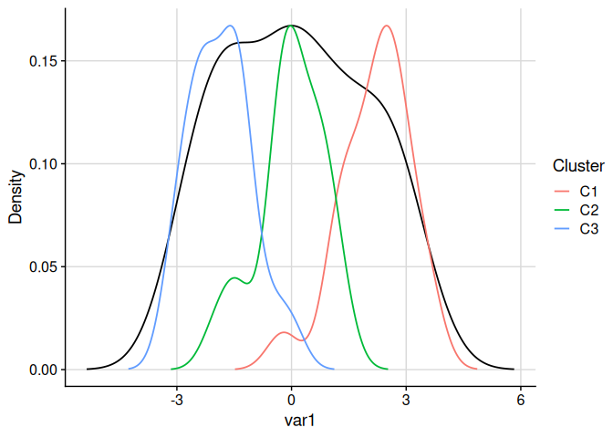

    #> 
    #> $var2

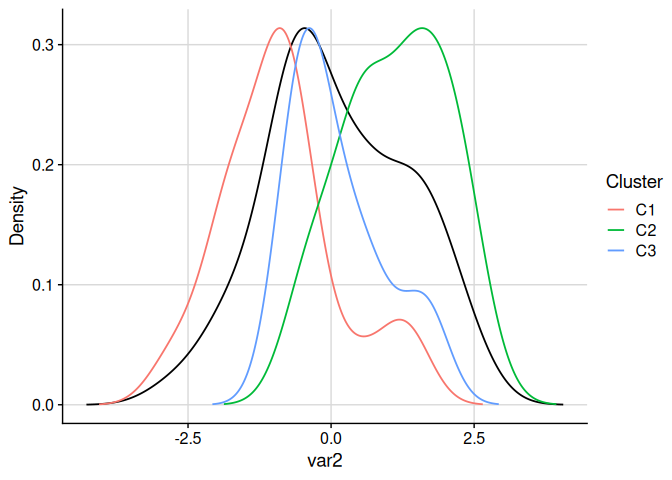

#### Scatter Plot with `plot_cluster_scatter`

The function `plot_cluster_scatter` creates a biaxial scatter plot with
observations coloured by cluster and median centroids overlaid. When
more than two variables are supplied it defaults to a PCA projection.

``` r
set.seed(123)
example_data <- data.frame(
  cluster = rep(c("A", "B", "C"), each = 20),
  var1 = c(rnorm(20, 2), rnorm(20, 0), rnorm(20, -2)),
  var2 = c(rnorm(20, -1), rnorm(20, 1), rnorm(20, 0)),
  var3 = c(rnorm(20, 1), rnorm(20, -1), rnorm(20, 0))
)

# Default: PCA projection (> 2 numeric variables)
plot_cluster_scatter(example_data, cluster = "cluster")
#> dim_red automatically set to 'pca' because more than two numeric variables are available.
```

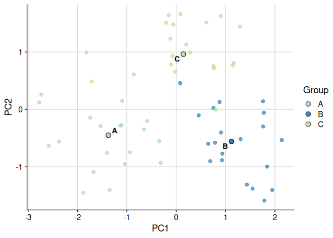

Raw variables can also be used directly:

``` r
plot_cluster_scatter(
  example_data,
  cluster = "cluster",
  dim_red = "none",
  vars = c("var1", "var2")
)
```

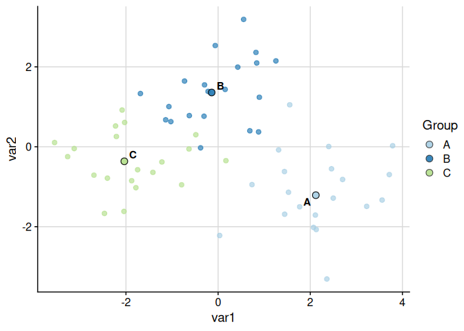

#### Minimum-Spanning Tree with `plot_cluster_mst`

The function `plot_cluster_mst` computes the minimum-spanning tree (MST)
over clusters, using Euclidean distance between cluster median profiles.
Clusters are laid out in two dimensions via classical multidimensional
scaling (MDS). For each variable, a separate plot is produced in which
each node is filled according to the ECDF-standardised percentile of
that cluster’s median — the same colour scale used by
`plot_cluster_heatmap`. By default a named list of plots is returned;
supplying `n_col` or `n_row` returns a combined `cowplot::plot_grid`
figure.

``` r
set.seed(1)
cluster_data <- data.frame(
  cluster = rep(paste0("C", 1:3), each = 20),
  var1 = c(rnorm(20, 2), rnorm(20, 0), rnorm(20, -2)),
  var2 = c(rnorm(20, -1), rnorm(20, 1), rnorm(20, 0))
)
# Default: returns a named list of plots, one per variable
plot_list <- plot_cluster_mst(cluster_data, cluster = "cluster")
plot_list[["var1"]]
```


Combine into a grid with variable-name labels:

``` r
plot_cluster_mst(cluster_data, cluster = "cluster", n_col = 2)
```

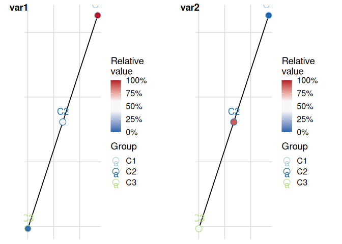

### Transformations with `get_trans`

The utility function `get_trans` returns `trans` objects (as implemented
by the `scales` package) when given characters. It also adds various
higher roots (such as cubic and quartic) and adds the `asinh`
transformation.

``` r
get_trans("log10")
#> Transformer: log-10 [1e-100, Inf]
```
