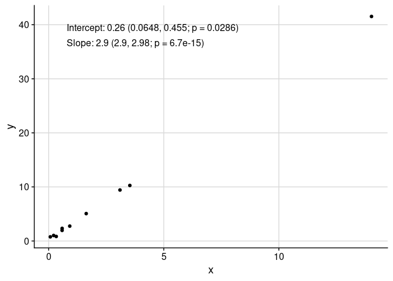
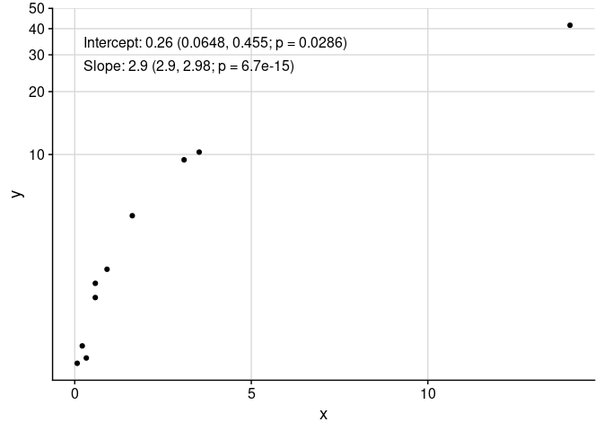
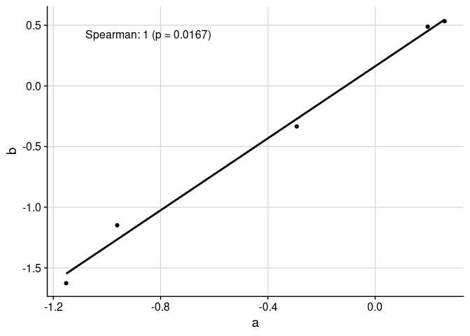
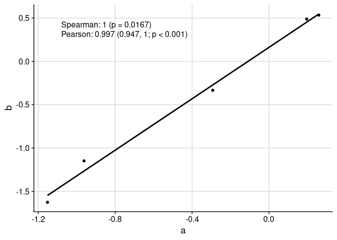
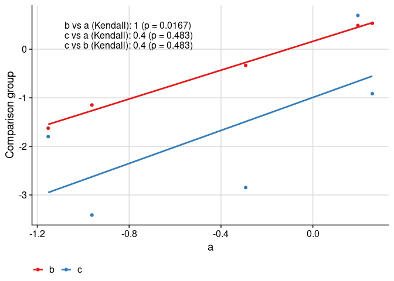
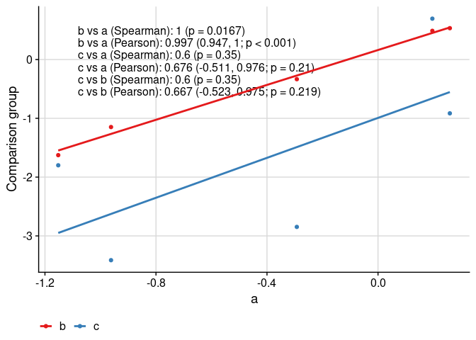
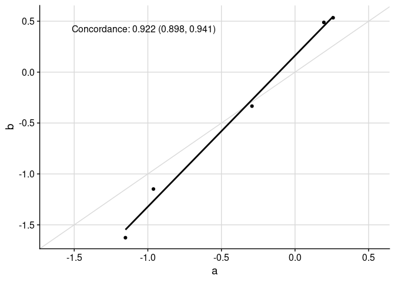
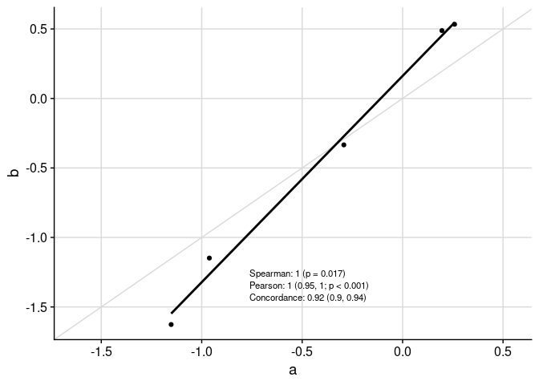
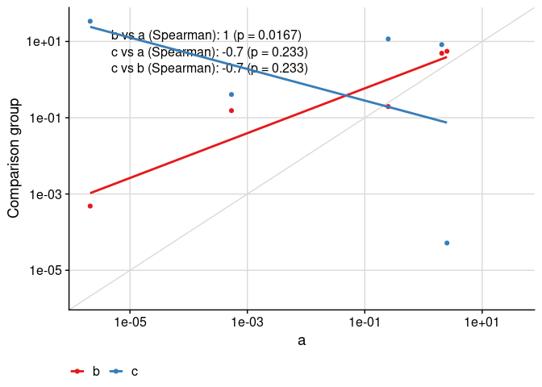

<!-- README.md is generated from README.Rmd. Please edit that file -->

# UtilsGGSV

<!-- badges: start -->

[](https://github.com/SATVILab/UtilsGGSV/actions/workflows/R-CMD-check.yaml)
<!-- badges: end -->

The goal of UtilsGGSV is to provide utility functions for plotting in R
using .

## Installation

You can install `UtilsGGSV` from [GitHub](https://github.com/) with:

``` r
if (!requireNamespace("remotes", quietly = TRUE)) install.packages("remotes")
remotes::install_github("SATVILab/UtilsGGSV")
```

## Examples

``` r
library(UtilsGGSV)
```

Fix axis limits to be equal between x- and y-axes, and/or expand axis
coordinates. The primary use of `axis_limits` is forcing the x- and
y-axes to have the same limits “automatically” (i.e. by inspecting the
`ggplot` object, thus not requiring the user to automatically calculate
limits to pass to `ggplot2::expand_limits`).

``` r
data("cars", package = "datasets")
library(ggplot2)
theme_set(cowplot::theme_cowplot())

p0 <- ggplot(cars, aes(speed, dist)) +
  cowplot::background_grid(major = "xy") +
  geom_point() +
  theme(plot.title = element_text(hjust = 0.5)) +
  labs(title = "Axes unadjusted") +
  labs(x = "Speed", y = "Distance")
p1 <- axis_limits(
  p = p0,
  limits_equal = TRUE
) +
  labs(title = "Axes limits equal")
p2 <- axis_limits(
  p = p0,
  limits_expand = list(
    x = c(0, 50),
    y = c(-10, 200)
  )
) +
  labs(title = "Axes limits expanded")
cowplot::plot_grid(p0, p1, p2)
```


Add a column of text easily to a plot, regardless of underlying
transformation, using `add_text_column`.

``` r
data_mod <- data.frame(x = rnorm(mean = 1, 10)^2)
data_mod$y <- data_mod$x * 3 + rnorm(10, sd = 0.5)
fit <- lm(y ~ x, data = data_mod)
coef_tbl <- coefficients(summary(fit))
results_vec <- c(
  paste0(
    "Intercept: ",
    signif(coef_tbl[1, "Estimate"][[1]], 2),
    " (",
    signif(coef_tbl[1, 1][[1]] - 2 * coef_tbl[1, 2][[1]], 3),
    ", ",
    signif(coef_tbl[1, 1][[1]] + 2 * coef_tbl[1, 2][[1]], 3),
    "; p = ",
    signif(coef_tbl[1, 4][[1]], 3),
    ")"
  ),
  paste0(
    "Slope: ",
    signif(coef_tbl[2, "Estimate"][[1]], 2),
    " (",
    signif(coef_tbl[2, 1][[1]] - 2 * coef_tbl[2, 2][[1]], 3),
    ", ",
    signif(coef_tbl[2, 1][[1]] + 2 * coef_tbl[2, 2][[1]], 3),
    "; p = ",
    signif(coef_tbl[2, 4][[1]], 3),
    ")"
  )
)
p <- ggplot(
  data = data_mod,
  aes(x = x, y = y)
) +
  geom_point() +
  cowplot::background_grid(major = "xy") 
add_text_column(
  p = p,
  x = data_mod$x,
  y = data_mod$y,
  text = results_vec,
  coord = c(0.05, 0.95),
  skip = 0.07
)
```



Note that `add_text_column` places text in the same position, regardless
of underlying transformation.

``` r
p <- p +
  scale_y_continuous(
    trans = UtilsGGSV::get_trans("asinh")
  )
add_text_column(
  p = p,
  x = data_mod$x,
  y = data_mod$y,
  text = results_vec,
  trans = UtilsGGSV::get_trans("asinh"),
  coord = c(0.05, 0.95),
  skip = 0.07
)
```



The utility function `get_trans` returns `trans` objects (as implemented
by the `scales` package) when given characters. It also adds various
higher roots (such as cubic and quartic) and adds the `asinh`
transformation.

``` r
get_trans("log10")
#> Transformer: log-10 [1e-100, Inf]
```

The function `ggcorr` plots correlation coefficients:

``` r
set.seed(3)
response_vec_a <- rnorm(5)
response_tbl <- data.frame(
  group = rep(letters[1:3], each = 5),
  response = c(
    response_vec_a,
    response_vec_a * 1.2 + rnorm(5, sd = 0.2),
    response_vec_a * 2 + rnorm(5, sd = 2)
  ),
  pid = rep(paste0("id_", 1:5), 3)
)

ggcorr(
  data = response_tbl |> dplyr::filter(group %in% c("a", "b")),
  grp = "group",
  y = "response",
  id = "pid"
)
```



We can display multiple correlation coefficients:

``` r
ggcorr(
  data = response_tbl |> dplyr::filter(group %in% c("a", "b")),
  grp = "group",
  y = "response",
  id = "pid",
  corr_method = c("spearman", "pearson")
)
```



We can compare more than two groups:

``` r
ggcorr(
  data = response_tbl,
  grp = "group",
  y = "response",
  id = "pid",
  corr_method = "kendall"
)
```



We can compare more than two groups and multiple correlation
coefficients:

``` r
ggcorr(
  data = response_tbl,
  grp = "group",
  y = "response",
  id = "pid",
  corr_method = c("spearman", "pearson")
)
```



Specific functionality to make appropriate plots for the concordance
correlation coefficient is available:

``` r
ggcorr(
  data = response_tbl |> dplyr::filter(group %in% c("a", "b")),
  grp = "group",
  y = "response",
  id = "pid",
  corr_method = "concordance",
  abline = TRUE,
  limits_equal = TRUE
)
```



Text in table can be moved around and resized:

``` r
ggcorr(
  data = response_tbl |> dplyr::filter(group %in% c("a", "b")),
  grp = "group",
  y = "response",
  id = "pid",
  corr_method = c("spearman", "pearson", "concordance"),
  abline = TRUE,
  limits_equal = TRUE,
  coord = c(0.4, 0.17),
  font_size = 3,
  skip = 0.04,
  pval_signif = 2,
  est_signif = 2,
  ci_signif = 2
)
```



Finally, the text placement is kept consistent when the axes are
visually transformed:

``` r
ggcorr(
  data = response_tbl |> dplyr::mutate(response = abs(response + 1)^4),
  grp = "group",
  y = "response",
  id = "pid",
  corr_method = "spearman",
  abline = TRUE,
  limits_equal = TRUE,
  trans = "log10",
  skip = 0.06
)
```


