# Getting Started with UtilsGGSV

## Introduction

UtilsGGSV provides utility functions for plotting in R using `ggplot2`.
This vignette demonstrates the main functions of the package.

``` r
library(UtilsGGSV)
library(ggplot2)
library(magrittr)
theme_set(cowplot::theme_cowplot())
```

## Correlation Plots with `ggcorr`

The `ggcorr` function creates scatterplots with correlation coefficients
overlaid. This is the primary function of the package and is useful for
visualizing relationships between groups of measurements.

### Basic Usage

``` r
set.seed(3)
response_vec_a <- rnorm(5)
response_tbl <- data.frame(
  group = rep(letters[1:3], each = 5),
  response = c(
    response_vec_a,
    response_vec_a * 1.2 + rnorm(5, sd = 0.2),
    response_vec_a * 2 + rnorm(5, sd = 2)
  ),
  pid = rep(paste0("id_", 1:5), 3)
)

ggcorr(
  data = response_tbl %>% dplyr::filter(group %in% c("a", "b")),
  grp = "group",
  y = "response",
  id = "pid"
)
```

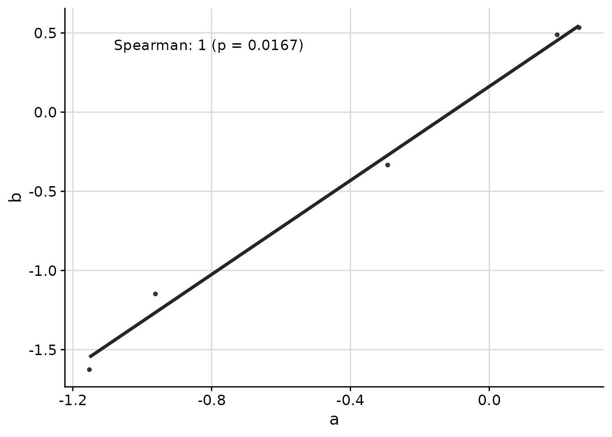

### Multiple Correlation Methods

You can display multiple correlation coefficients simultaneously:

``` r
ggcorr(
  data = response_tbl %>% dplyr::filter(group %in% c("a", "b")),
  grp = "group",
  y = "response",
  id = "pid",
  corr_method = c("spearman", "pearson")
)
```

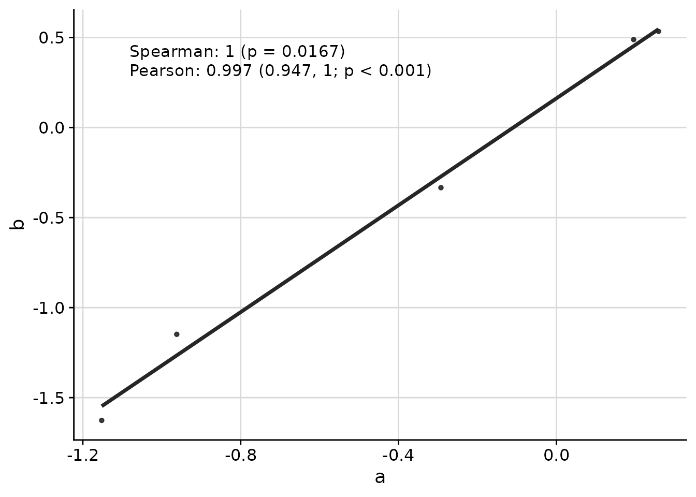

### Comparing Multiple Groups

When comparing more than two groups, the function creates pairwise
comparisons:

``` r
ggcorr(
  data = response_tbl,
  grp = "group",
  y = "response",
  id = "pid",
  corr_method = "kendall"
)
```

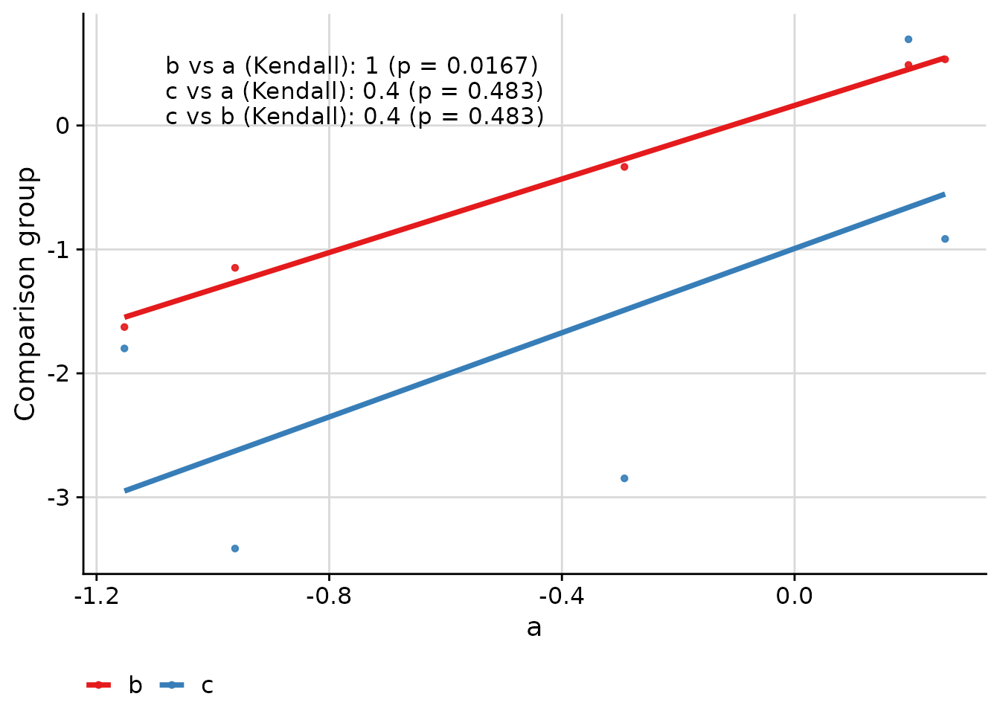

### Concordance Correlation Coefficient

The concordance correlation coefficient is useful when assessing
agreement between two methods:

``` r
ggcorr(
  data = response_tbl %>% dplyr::filter(group %in% c("a", "b")),
  grp = "group",
  y = "response",
  id = "pid",
  corr_method = "concordance",
  abline = TRUE,
  limits_equal = TRUE
)
```

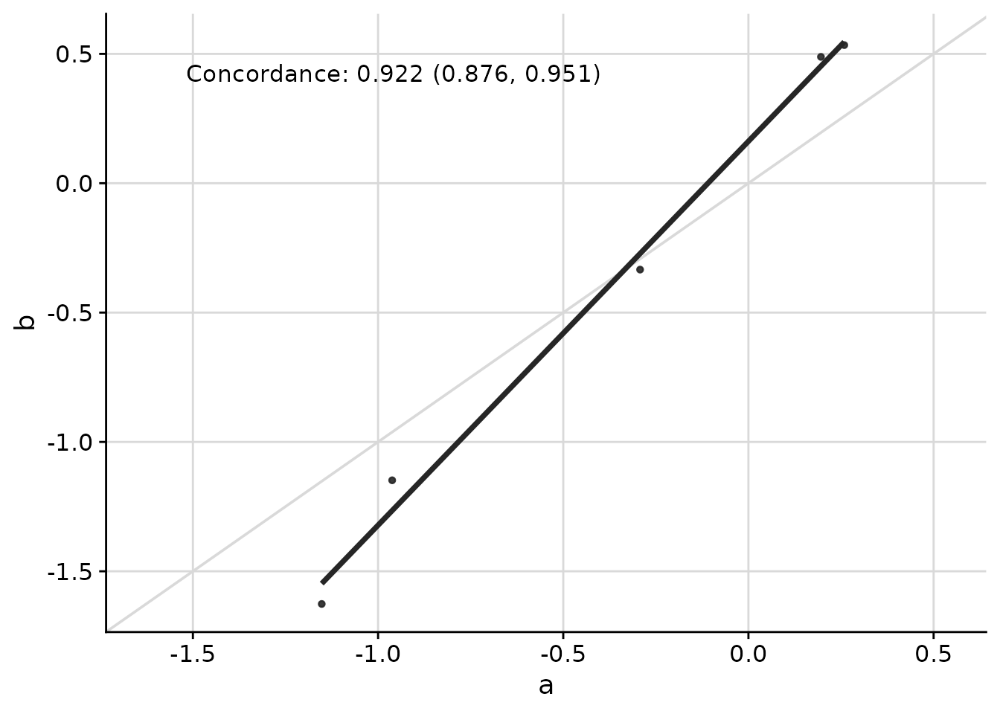

### Customizing Appearance

Text placement, font size, and other visual elements can be customized:

``` r
ggcorr(
  data = response_tbl %>% dplyr::filter(group %in% c("a", "b")),
  grp = "group",
  y = "response",
  id = "pid",
  corr_method = c("spearman", "pearson", "concordance"),
  abline = TRUE,
  limits_equal = TRUE,
  coord = c(0.4, 0.17),
  font_size = 3,
  skip = 0.04,
  pval_signif = 2,
  est_signif = 2,
  ci_signif = 2
)
```

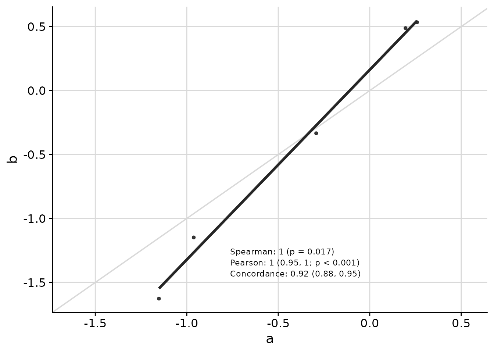

### Axis Transformations

The text placement remains consistent even when axes are transformed:

``` r
ggcorr(
  data = response_tbl %>% dplyr::mutate(response = abs(response + 1)^4),
  grp = "group",
  y = "response",
  id = "pid",
  corr_method = "spearman",
  abline = TRUE,
  limits_equal = TRUE,
  trans = "log10",
  skip = 0.06
)
```

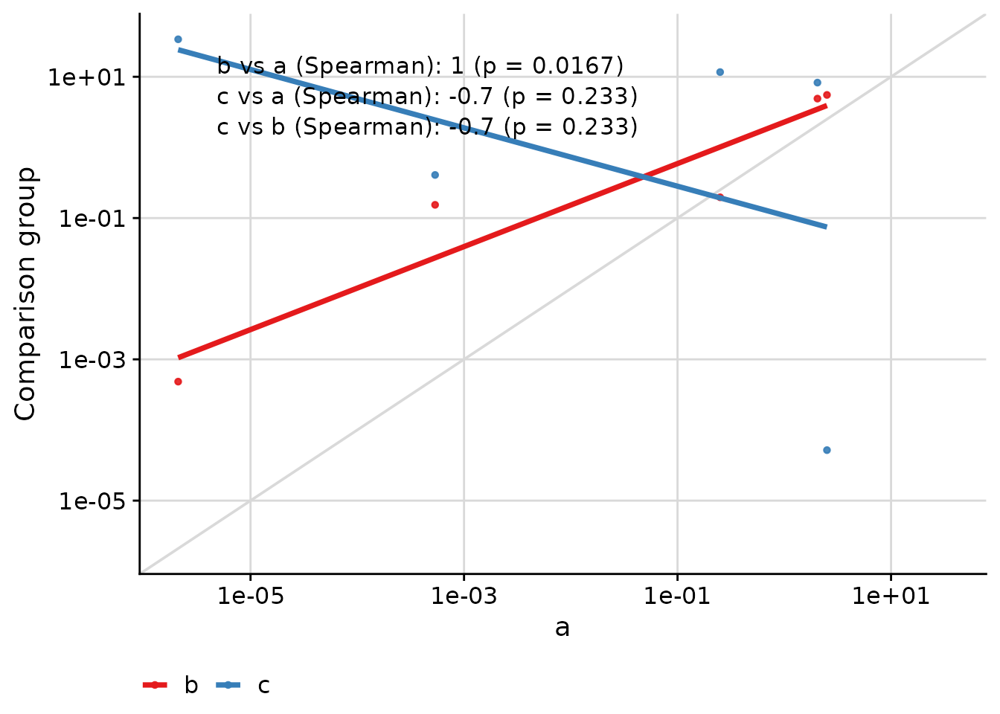

## Managing Axis Limits with `axis_limits`

The `axis_limits` function helps manage axis limits, particularly useful
for forcing equal limits on both axes or expanding axis coordinates.

``` r
data("cars", package = "datasets")

p0 <- ggplot(cars, aes(speed, dist)) +
  cowplot::background_grid(major = "xy") +
  geom_point() +
  theme(plot.title = element_text(hjust = 0.5)) +
  labs(title = "Axes unadjusted") +
  labs(x = "Speed", y = "Distance")

p1 <- axis_limits(
  p = p0,
  limits_equal = TRUE
) +
  labs(title = "Axes limits equal")

p2 <- axis_limits(
  p = p0,
  limits_expand = list(
    x = c(0, 50),
    y = c(-10, 200)
  )
) +
  labs(title = "Axes limits expanded")

cowplot::plot_grid(p0, p1, p2)
```

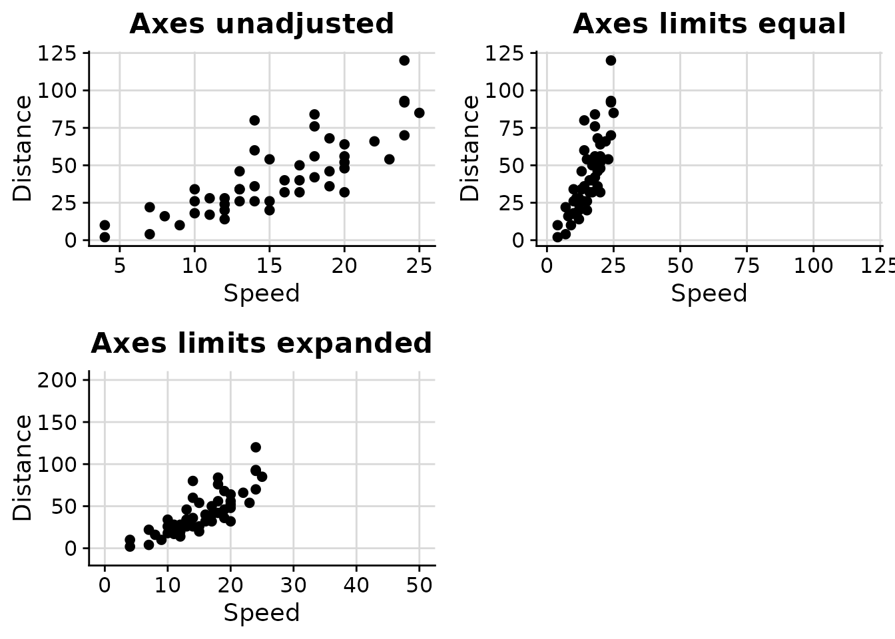

## Adding Text Annotations with `add_text_column`

The `add_text_column` function adds text annotations to plots at
consistent positions, regardless of underlying axis transformations.

``` r
data_mod <- data.frame(x = rnorm(mean = 1, 10)^2)
data_mod$y <- data_mod$x * 3 + rnorm(10, sd = 0.5)
fit <- lm(y ~ x, data = data_mod)
coef_tbl <- coefficients(summary(fit))
results_vec <- c(
  paste0(
    "Intercept: ",
    signif(coef_tbl[1, "Estimate"][[1]], 2),
    " (",
    signif(coef_tbl[1, 1][[1]] - 2 * coef_tbl[1, 2][[1]], 3),
    ", ",
    signif(coef_tbl[1, 1][[1]] + 2 * coef_tbl[1, 2][[1]], 3),
    "; p = ",
    signif(coef_tbl[1, 4][[1]], 3),
    ")"
  ),
  paste0(
    "Slope: ",
    signif(coef_tbl[2, "Estimate"][[1]], 2),
    " (",
    signif(coef_tbl[2, 1][[1]] - 2 * coef_tbl[2, 2][[1]], 3),
    ", ",
    signif(coef_tbl[2, 1][[1]] + 2 * coef_tbl[2, 2][[1]], 3),
    "; p = ",
    signif(coef_tbl[2, 4][[1]], 3),
    ")"
  )
)

p <- ggplot(
  data = data_mod,
  aes(x = x, y = y)
) +
  geom_point() +
  cowplot::background_grid(major = "xy")

add_text_column(
  p = p,
  x = data_mod$x,
  y = data_mod$y,
  text = results_vec,
  coord = c(0.05, 0.95),
  skip = 0.07
)
```

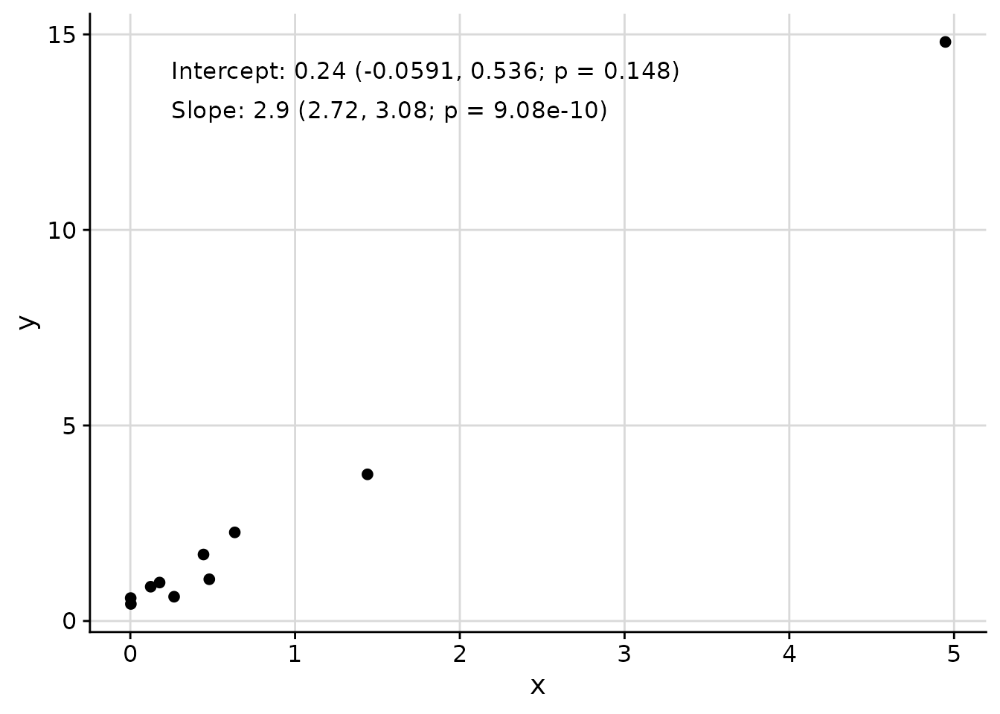

## Cluster-Specific Plots

The `plot_cluster_*` family of functions helps visualise the
characteristics of clusters identified by an unsupervised learning
method. The examples below use the `palmerpenguins` dataset: we first
apply k-means clustering to bill and flipper measurements, then explore
the clusters using each function.

``` r
set.seed(42)
penguins <- palmerpenguins::penguins
penguins <- penguins[complete.cases(penguins[
  c("bill_length_mm", "bill_depth_mm", "flipper_length_mm", "body_mass_g")
]), ]
vars_penguin <- c(
  "bill_length_mm", "bill_depth_mm", "flipper_length_mm", "body_mass_g"
)
km <- kmeans(scale(penguins[vars_penguin]), centers = 3)
penguins$cluster <- paste0("K", km$cluster)
```

### Heat Maps with `plot_cluster_heatmap`

The `plot_cluster_heatmap` function creates a heat map where each tile
shows the percentile of the median value of a variable for a cluster.
This percentile is compared against the empirical cumulative
distribution function (ECDF) of that variable across all observations
not in the cluster. Clusters and variables are ordered along the axes
via hierarchical clustering.

``` r
plot_cluster_heatmap(penguins, cluster = "cluster", vars = vars_penguin)
```

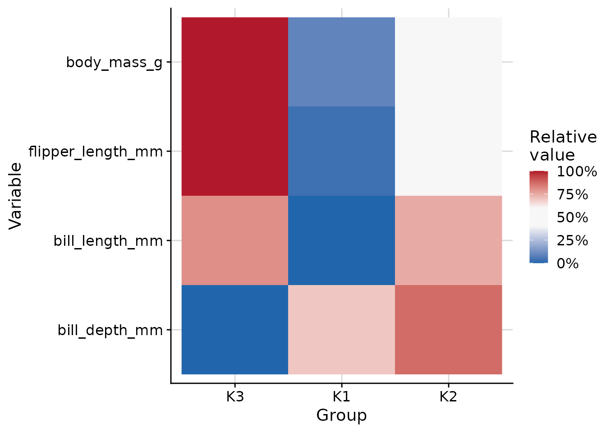

### Density Plots with `plot_cluster_density`

The `plot_cluster_density` function visualises, for each variable, how
each cluster’s observations are distributed relative to the overall
population. The `density` argument controls what is shown:

- `"overall"` (default): the overall density with per-cluster median
  lines.
- `"cluster"`: one density curve per cluster.
- `"both"`: overall density plus per-cluster density curves.

#### Overall density with cluster median lines (default)

``` r
plot_cluster_density(
  penguins,
  cluster = "cluster",
  vars = vars_penguin,
  n_col = 2
)
```

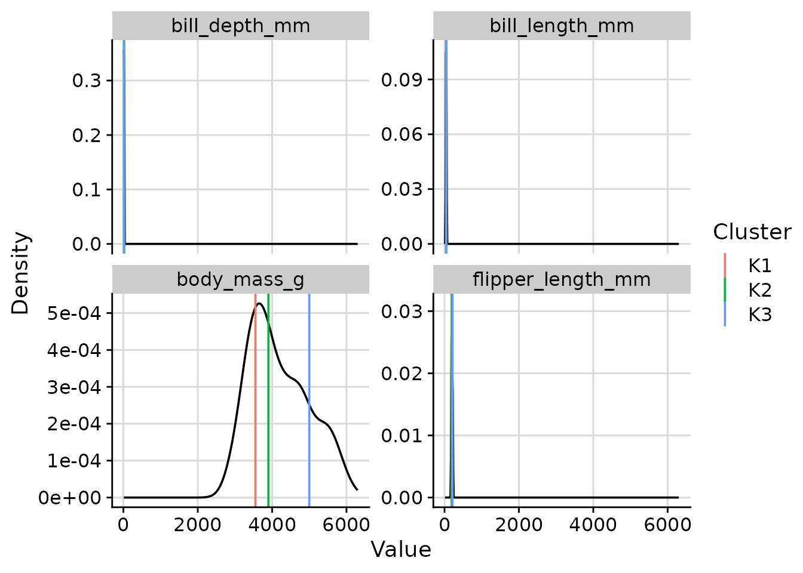

#### Per-cluster density curves

``` r
plot_cluster_density(
  penguins,
  cluster = "cluster",
  vars = vars_penguin,
  density = "cluster",
  n_col = 2
)
```

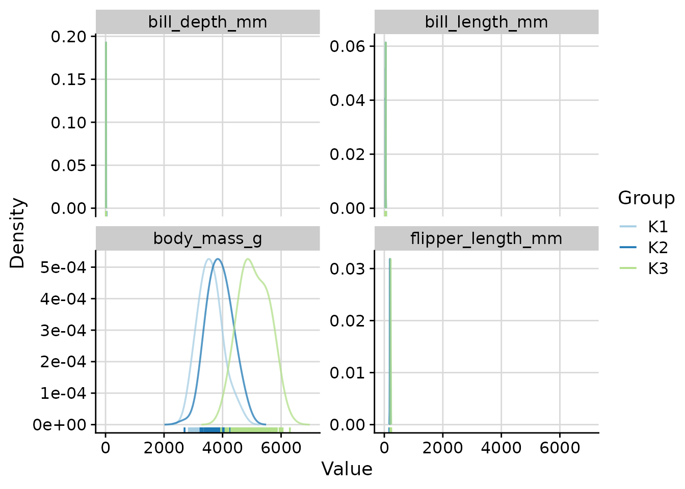

#### Both overall and per-cluster densities

When `density = "both"`, the `scale` argument controls how cluster
curves are scaled relative to the overall density:

- `"max_overall"` (default): each cluster density is rescaled so that
  its maximum equals the maximum of the overall density. Y-axis values
  reflect the overall density.
- `"max_cluster"`: no rescaling; the y-axis is determined by the tallest
  curve.
- `"free"`: no rescaling (equivalent to `"max_cluster"`).

``` r
# scale = "max_overall" keeps the y-axis anchored to the overall density
plot_cluster_density(
  penguins,
  cluster = "cluster",
  vars = vars_penguin,
  density = "both",
  scale = "max_overall",
  n_col = 2
)
```

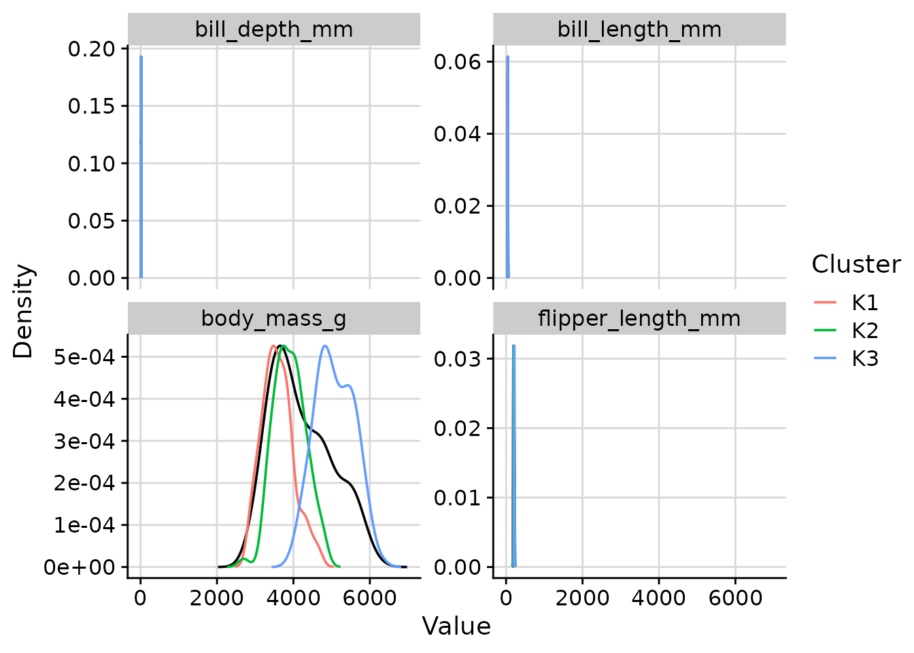

``` r
# scale = "max_cluster": natural scale for all curves
plot_cluster_density(
  penguins,
  cluster = "cluster",
  vars = vars_penguin,
  density = "both",
  scale = "max_cluster",
  n_col = 2
)
```

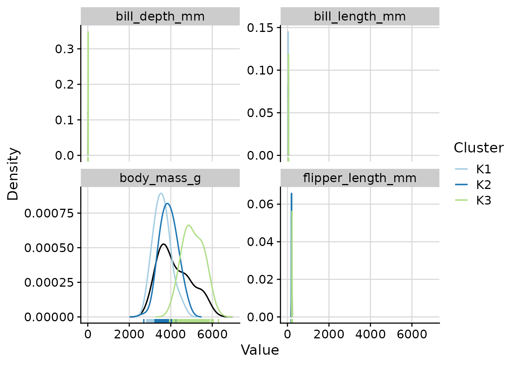

### Scatter Plot with `plot_cluster_scatter`

The `plot_cluster_scatter` function creates a biaxial scatter plot with
observations coloured by cluster and median centroids overlaid. It
supports four dimensionality reduction methods via the `dim_red`
argument: `"none"`, `"pca"`, `"tsne"`, and `"umap"`.

#### PCA projection (default for more than two variables)

``` r
plot_cluster_scatter(
  penguins,
  cluster = "cluster",
  vars = vars_penguin,
  dim_red = "pca"
)
```

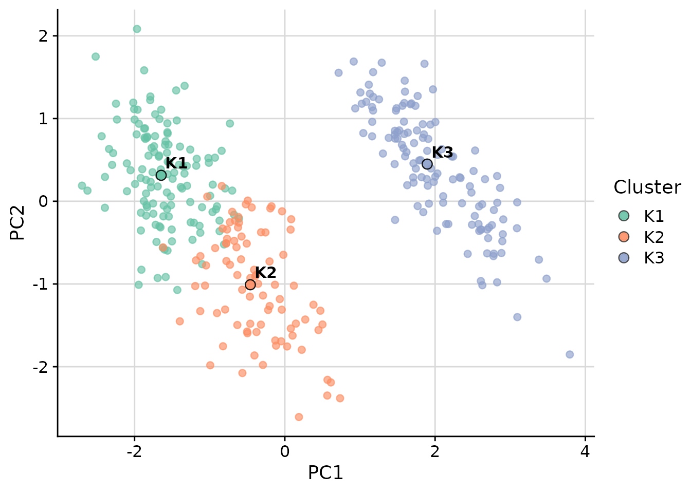

#### Raw variables (`dim_red = "none"`)

When exactly two variables are needed directly as axes:

``` r
plot_cluster_scatter(
  penguins,
  cluster = "cluster",
  vars = c("bill_length_mm", "flipper_length_mm"),
  dim_red = "none"
)
```

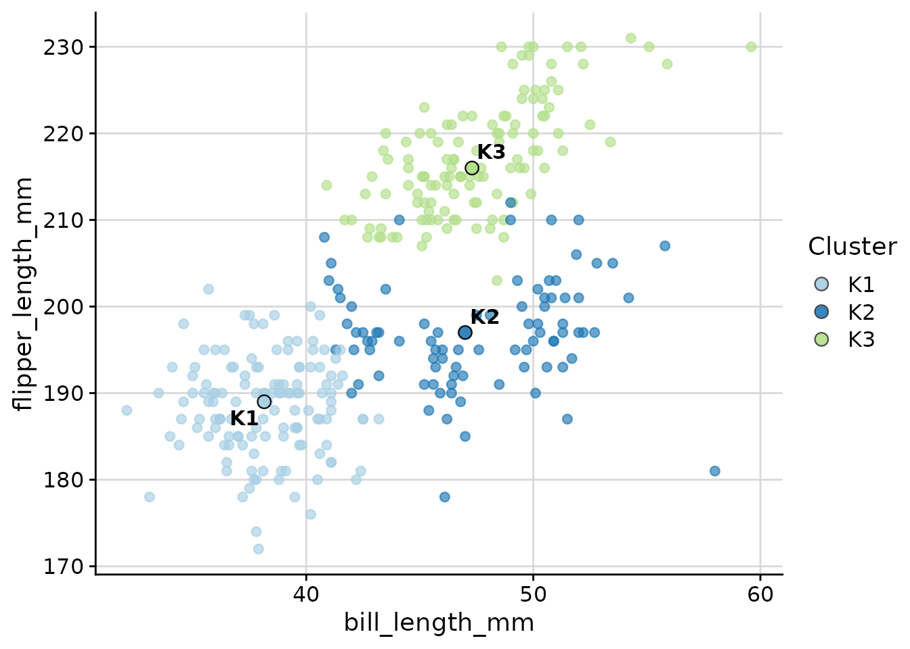

#### t-SNE

t-SNE is available when the `Rtsne` package is installed:

``` r
plot_cluster_scatter(
  penguins,
  cluster = "cluster",
  vars = vars_penguin,
  dim_red = "tsne"
)
```

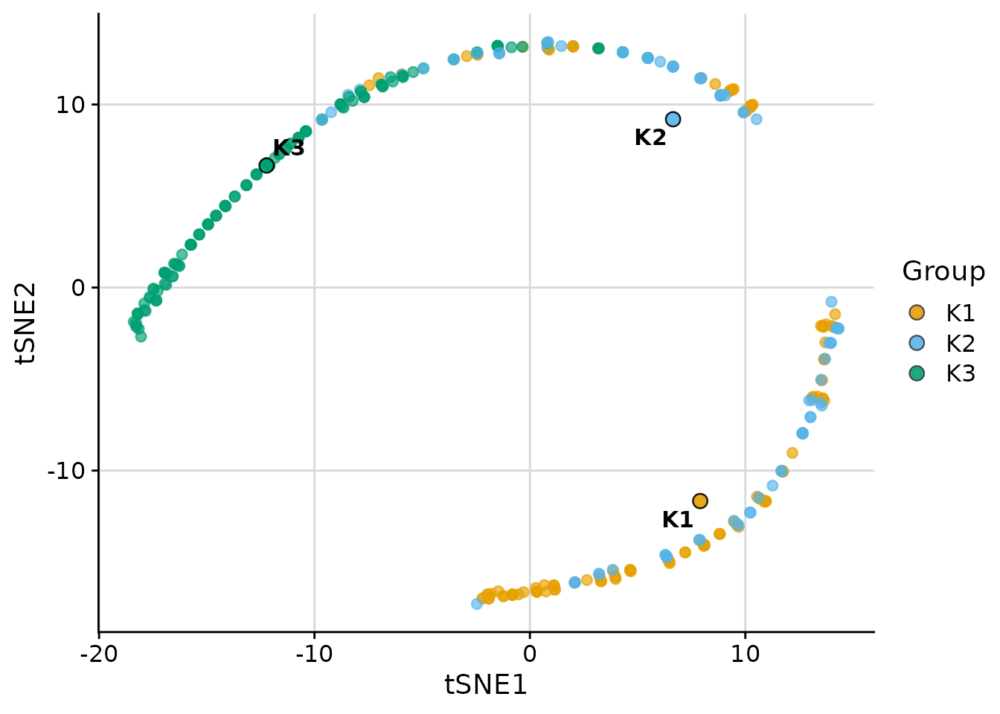

#### UMAP

UMAP is available when the `umap` package is installed:

``` r
plot_cluster_scatter(
  penguins,
  cluster = "cluster",
  vars = vars_penguin,
  dim_red = "umap"
)
```

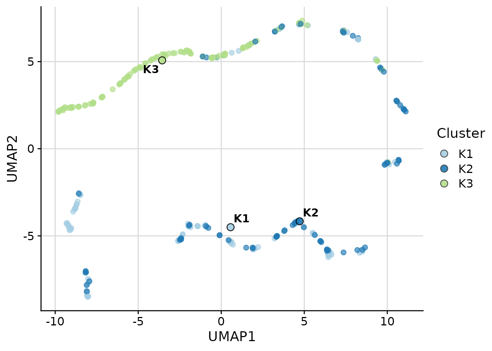

### Minimum-Spanning Tree with `plot_cluster_mst`

The `plot_cluster_mst` function computes the minimum-spanning tree (MST)
over clusters, using Euclidean distance between cluster median profiles.
Clusters are positioned in two dimensions via classical multidimensional
scaling (MDS). For each variable, a separate plot shows each cluster
node filled by the ECDF-standardised percentile of that cluster’s median
— the same colour scale used by `plot_cluster_heatmap`. By default a
named list of plots is returned; supplying `n_col` or `n_row` returns a
combined
[`cowplot::plot_grid`](https://wilkelab.org/cowplot/reference/plot_grid.html)
figure with variable names as labels.

``` r
plot_cluster_mst(
  penguins,
  cluster = "cluster",
  vars = vars_penguin,
  n_col = 2
)
```

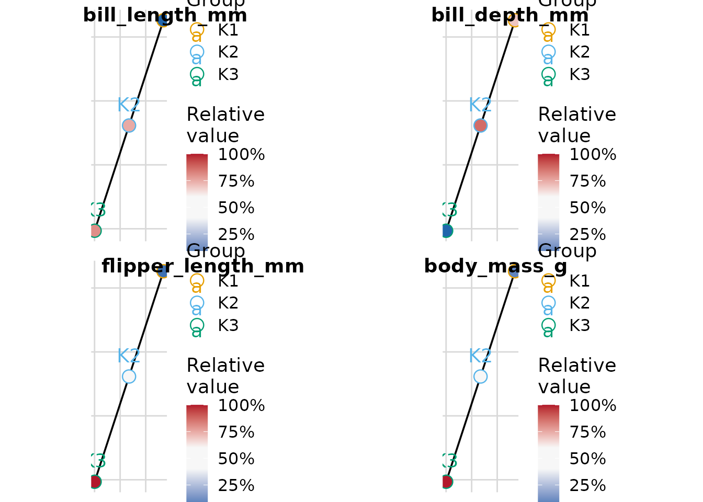

## Transformations with `get_trans`

The `get_trans` function returns transformation objects from the
`scales` package. It adds support for additional transformations like
higher roots and `asinh`:

``` r
get_trans("log10")
#> Transformer: log-10 [1e-100, Inf]
get_trans("asinh")
#> Transformer: asinh [-Inf, Inf]
get_trans("root_cube")
#> Transformer: root_3 [-Inf, Inf]
```
