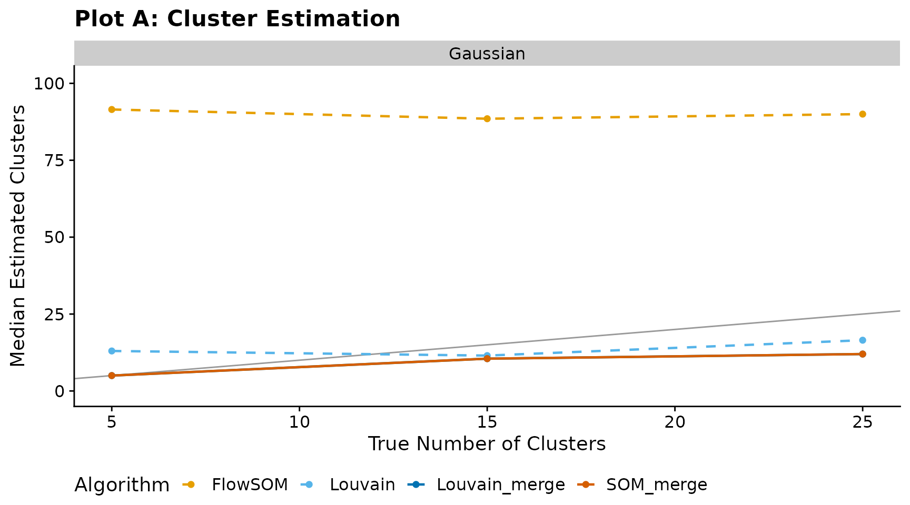
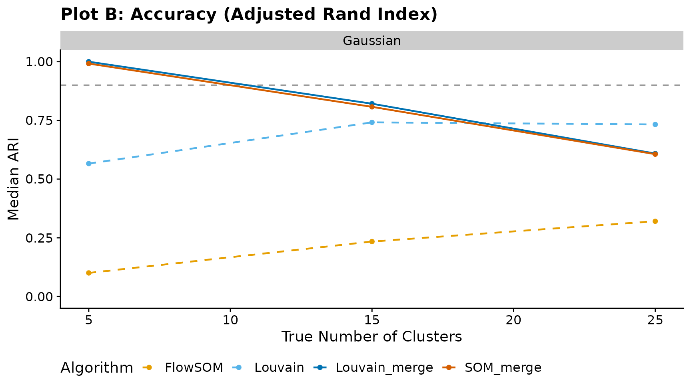

# Benchmarking cluster_som_merge and cluster_louvain_merge via FAUST Simulations

## Overview

This vignette evaluates
[`cluster_som_merge()`](https://satvilab.github.io/UtilsGGSV/reference/cluster_som_merge.md)
and
[`cluster_louvain_merge()`](https://satvilab.github.io/UtilsGGSV/reference/cluster_louvain_merge.md)
against their standard counterparts (FlowSOM-style SOM clustering and
Louvain community detection) using the FAUST simulation framework
(Greene et al., 2021, *Patterns*).

Our label-based merging strategies use
[`cluster_merge_bin()`](https://satvilab.github.io/UtilsGGSV/reference/cluster_merge_bin.md)
to assign threshold-derived bin labels, then
[`cluster_merge_unimodal()`](https://satvilab.github.io/UtilsGGSV/reference/cluster_merge_unimodal.md)
to iteratively merge over-segmented clusters that remain unimodal
(assessed via Hartigan’s Dip Test and SCAMP L-moment scoring). The goal
is to recover the true number of clusters more accurately than the raw
algorithms while maintaining high Adjusted Rand Index (ARI).

## Configuration

Set `full <- TRUE` below to run the complete FAUST-paper grid (12
cluster counts × 5 iterations × 2 regimes on 250 000 cells per
iteration). The full run takes several hours. By default, the vignette
runs a quick demonstration with reduced parameters.

``` r
full <- FALSE
```

``` r
library(UtilsGGSV)
library(ggplot2)
library(dplyr)
#> 
#> Attaching package: 'dplyr'
#> The following objects are masked from 'package:stats':
#> 
#>     filter, lag
#> The following objects are masked from 'package:base':
#> 
#>     intersect, setdiff, setequal, union
```

``` r
if (full) {
  cluster_counts     <- seq(5, 115, by = 10)
  n_iter             <- 5L
  n_samples          <- 10L
  n_cells_per_sample <- 25000L
  n_dims             <- 10L
  noise_dims         <- 5L
} else {
  cluster_counts     <- c(5, 15, 25)
  n_iter             <- 2L
  n_samples          <- 2L
  n_cells_per_sample <- 500L
  n_dims             <- 5L
  noise_dims         <- 2L
}

transforms <- c("none", "faust_gamma")[[1]]
```

## 1. Helpers

### Adjusted Rand Index

A self-contained ARI implementation so the vignette has no extra
dependencies:

``` r
ari <- function(labels_true, labels_pred) {
  ct <- table(labels_true, labels_pred)
  sum_comb2 <- function(x) sum(choose(x, 2))
  a <- sum_comb2(ct)
  b <- sum_comb2(rowSums(ct))
  cc <- sum_comb2(colSums(ct))
  n <- sum(ct)
  d <- choose(n, 2)
  expected <- b * cc / d
  max_index <- (b + cc) / 2
  if (max_index == expected) return(1)
  (a - expected) / (max_index - expected)
}
```

### Algorithm runner

Applies all four algorithms to a single data matrix:

``` r
run_algorithms <- function(mat, vars) {
  thresholds <- stats::setNames(
    lapply(vars, function(v) 4),
    vars
  )

  # 1. FlowSOM (standard SOM assignment)
  som_cl <- cluster_som(mat, vars = vars)

  # 2. cluster_som_merge (SOM + bin + unimodal merge)
  som_merge_res <- cluster_som_merge(
    mat, vars = vars, thresholds = thresholds
  )

  # 3. Louvain (standard community detection)
  louv_cl <- cluster_louvain(mat, vars = vars)

  # 4. cluster_louvain_merge (Louvain + bin + unimodal merge)
  louv_merge_res <- cluster_louvain_merge(
    mat, vars = vars, thresholds = thresholds
  )

  list(
    FlowSOM       = list(
      labels = som_cl,
      k      = length(unique(som_cl))
    ),
    SOM_merge     = list(
      labels = som_merge_res$assign$merged,
      k      = length(unique(som_merge_res$assign$merged))
    ),
    Louvain       = list(
      labels = louv_cl,
      k      = length(unique(louv_cl))
    ),
    Louvain_merge = list(
      labels = louv_merge_res$assign$merged,
      k      = length(unique(louv_merge_res$assign$merged))
    )
  )
}
```

## 2. Load or compute results

If pre-computed results exist (generated by
`data-raw/benchmarking_merges.R`), they are loaded directly. Otherwise
the simulation grid defined above is executed.

``` r
precomputed_path <- system.file(
  "extdata", "benchmarking_merges.rds",
  package = "UtilsGGSV"
)

if (nzchar(precomputed_path) && file.exists(precomputed_path)) {
  message("Loading pre-computed results from ", precomputed_path)
  bench_data    <- readRDS(precomputed_path)
  results       <- bench_data$results
  bench_summary <- bench_data$bench_summary
  single_pop    <- bench_data$single_pop
} else {
  message("No pre-computed results found; running simulation grid...")

  results <- data.frame(
    transform   = character(0),
    n_clusters  = integer(0),
    iter        = integer(0),
    algorithm   = character(0),
    k_estimated = integer(0),
    ari         = numeric(0),
    stringsAsFactors = FALSE
  )

  for (tx in transforms) {
    for (nc in cluster_counts) {
      for (it in seq_len(n_iter)) {
        sim <- cluster_sim(
          n_samples          = n_samples,
          n_clusters         = nc,
          n_dims             = n_dims,
          n_cells_per_sample = n_cells_per_sample,
          noise_dims         = noise_dims,
          transform          = tx
        )
        p <- UtilsGGSV::plot_group_density(
          .data = sim$data |>
            dplyr::mutate(cluster_id = as.character(cluster_id)),
          group = "cluster_id",
          vars = c(paste0("dim_", 1:5), paste0("noise_", 1:2)),
          n_col = 3
        )
        if (!dir.exists("_tmp")) dir.create("_tmp")
        ggplot2::ggsave(
          plot = p,
          filename = file.path("_tmp", "p-test.png"),
          units = "cm",
          width = 30,
          height = 15
        )

        dim_vars    <- paste0("dim_", seq_len(n_dims))
        mat         <- as.data.frame(sim$data[, dim_vars])
        true_labels <- as.character(sim$data$cluster_id)
        algo_res    <- run_algorithms(mat, dim_vars)

        for (alg_name in names(algo_res)) {
          results <- rbind(results, data.frame(
            transform   = if (tx == "none") "Gaussian" else "Non-Gaussian",
            n_clusters  = nc,
            iter        = it,
            algorithm   = alg_name,
            k_estimated = algo_res[[alg_name]]$k,
            ari         = ari(true_labels, algo_res[[alg_name]]$labels),
            stringsAsFactors = FALSE
          ))
        }
      }
    }
  }

  bench_summary <- results |>
    dplyr::group_by(transform, n_clusters, algorithm) |>
    dplyr::summarise(
      median_k   = stats::median(k_estimated),
      median_ari = stats::median(ari),
      .groups    = "drop"
    )

  # ---- Single-population sanity check ----
  single_pop <- data.frame(
    iter        = integer(0),
    algorithm   = character(0),
    k_estimated = integer(0),
    stringsAsFactors = FALSE
  )

  for (it in seq_len(5L)) {
    sim1 <- cluster_sim(
      n_samples          = 1L,
      n_clusters         = 1L,
      n_dims             = 1L,
      n_cells_per_sample = 1000L,
      base_cluster_weights = 1
    )
    mat1        <- as.data.frame(sim1$data[, "dim_1", drop = FALSE])
    thresholds1 <- list(dim_1 = 0)

    som_cl1        <- cluster_som(mat1, vars = "dim_1", x_dim = 3, y_dim = 3)
    som_merge_res1 <- cluster_som_merge(
      mat1, vars = "dim_1", thresholds = thresholds1, x_dim = 3, y_dim = 3
    )
    louv_cl1        <- cluster_louvain(mat1, vars = "dim_1")
    louv_merge_res1 <- cluster_louvain_merge(
      mat1, vars = "dim_1", thresholds = thresholds1
    )

    single_pop <- rbind(single_pop, data.frame(
      iter        = it,
      algorithm   = c("FlowSOM", "SOM_merge", "Louvain", "Louvain_merge"),
      k_estimated = c(
        length(unique(som_cl1)),
        length(unique(som_merge_res1$assign$merged)),
        length(unique(louv_cl1)),
        length(unique(louv_merge_res1$assign$merged))
      ),
      stringsAsFactors = FALSE
    ))
  }
}
#> No pre-computed results found; running simulation grid...
#> Warning in RColorBrewer::brewer.pal(n, pal): n too large, allowed maximum for palette Paired is 12
#> Returning the palette you asked for with that many colors
#> Warning: Removed 10752 rows containing missing values or values outside the scale range
#> (`geom_line()`).
#> Warning in RColorBrewer::brewer.pal(n, pal): n too large, allowed maximum for palette Paired is 12
#> Returning the palette you asked for with that many colors
#> Warning: Removed 10752 rows containing missing values or values outside the scale range
#> (`geom_line()`).
#> Warning in RColorBrewer::brewer.pal(n, pal): n too large, allowed maximum for palette Paired is 12
#> Returning the palette you asked for with that many colors
#> Warning: Removed 46592 rows containing missing values or values outside the scale range
#> (`geom_line()`).
#> Warning in RColorBrewer::brewer.pal(n, pal): n too large, allowed maximum for palette Paired is 12
#> Returning the palette you asked for with that many colors
#> Warning: Removed 46592 rows containing missing values or values outside the scale range
#> (`geom_line()`).
```

## 3. Visualisations

### Plot A — Cluster estimation

Median number of estimated clusters versus the true number of clusters.
The diagonal $y = x$ line indicates perfect recovery.

``` r
has_results <- exists("bench_summary") && nrow(bench_summary) > 0

if (has_results) {
  algo_colours <- c(
    FlowSOM       = "#E69F00",
    SOM_merge     = "#D55E00",
    Louvain       = "#56B4E9",
    Louvain_merge = "#0072B2"
  )
  algo_linetypes <- c(
    FlowSOM       = "dashed",
    SOM_merge     = "solid",
    Louvain       = "dashed",
    Louvain_merge = "solid"
  )

  max_k <- max(bench_summary$n_clusters, bench_summary$median_k, na.rm = TRUE)

  ggplot(bench_summary, aes(
    x        = n_clusters,
    y        = median_k,
    colour   = algorithm,
    linetype = algorithm
  )) +
    geom_abline(slope = 1, intercept = 0, colour = "grey60", linewidth = 0.5) +
    geom_line(linewidth = 0.8) +
    geom_point(size = 1.5) +
    scale_colour_manual(values = algo_colours) +
    scale_linetype_manual(values = algo_linetypes) +
    facet_wrap(~transform) +
    coord_cartesian(ylim = c(0, max_k * 1.1)) +
    labs(
      title    = "Plot A: Cluster Estimation",
      x        = "True Number of Clusters",
      y        = "Median Estimated Clusters",
      colour   = "Algorithm",
      linetype = "Algorithm"
    ) +
    cowplot::theme_cowplot() +
    theme(legend.position = "bottom")
} else {
  message("No benchmark results available for Plot A.")
}
```



### Plot B — Accuracy (Adjusted Rand Index)

Median ARI versus true cluster count. The horizontal dashed line at 0.90
marks the high-accuracy threshold.

``` r
if (has_results) {
  ggplot(bench_summary, aes(
    x        = n_clusters,
    y        = median_ari,
    colour   = algorithm,
    linetype = algorithm
  )) +
    geom_hline(yintercept = 0.90, linetype = "dashed", colour = "grey60") +
    geom_line(linewidth = 0.8) +
    geom_point(size = 1.5) +
    scale_colour_manual(values = algo_colours) +
    scale_linetype_manual(values = algo_linetypes) +
    facet_wrap(~transform) +
    coord_cartesian(ylim = c(0, 1)) +
    labs(
      title    = "Plot B: Accuracy (Adjusted Rand Index)",
      x        = "True Number of Clusters",
      y        = "Median ARI",
      colour   = "Algorithm",
      linetype = "Algorithm"
    ) +
    cowplot::theme_cowplot() +
    theme(legend.position = "bottom")
} else {
  message("No benchmark results available for Plot B.")
}
```



## 4. Single-population sanity check

A minimal edge-case test: one variable, one true cluster (i.e. all
observations belong to the same population). Ideally every algorithm
should return a single cluster. The raw methods (FlowSOM, Louvain)
typically over-segment, while the merge variants should collapse back
toward one cluster.

``` r
has_single_pop <- exists("single_pop") && nrow(single_pop) > 0

if (has_single_pop) {
  single_pop |>
    dplyr::group_by(algorithm) |>
    dplyr::summarise(
      median_k = stats::median(k_estimated),
      min_k    = min(k_estimated),
      max_k    = max(k_estimated),
      .groups  = "drop"
    ) |>
    knitr::kable(
      caption = "Single-population test (1 variable, 1 true cluster)",
      col.names = c("Algorithm", "Median k", "Min k", "Max k")
    )
} else {
  message("No single-population results available.")
}
```

| Algorithm     | Median k | Min k | Max k |
|:--------------|---------:|------:|------:|
| FlowSOM       |        9 |     9 |     9 |
| Louvain       |       23 |    22 |    28 |
| Louvain_merge |        1 |     1 |     1 |
| SOM_merge     |        1 |     1 |     1 |

Single-population test (1 variable, 1 true cluster)

## References

Greene, E., Finak, G., D’Amico, L. A., Mber, N., Qi, Z., Srivastava, S.,
…, & Gottardo, R. (2021). FAUST: Full Annotation Using Shape-constrained
Trees. *Patterns*, 2(9), 100326.
